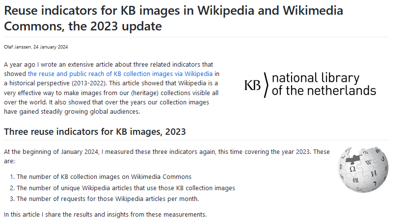

# Data stories for Wikimedia reuse indicators of the KB, national library of the Netherlands.

### [DBNL Wiki stat]((stories/xcccccc.md))

*Nov 2024*

Summary

 

-------------

### [Reuse indicators for KB images in Wikipedia and Wikimedia Commons, the 2023 update](stories/Reuse%20indicators%20for%20KB%20images%20in%20Wikipedia%20and%20Wikimedia%20Commons%2C%20the%202023%20update.md)
*24 January 2024*

A year ago I wrote an extensive article about three related indicators that showed the [reuse and public reach of KB collection images via Wikipedia](stories/Three%20reuse%20indicators%20for%20KB%20images%20in%20Wikipedia%20and%20Wikimedia%20Commons,%20in%20a%20historical%20perspective%20(2013-2022).md) in a historical perspective (2013-2022). This article showed that Wikipedia is a very effective way to make images from our (heritage) collections visible all over the world. It also showed that over the years our collection images have gained steadily growing global audiences.
At the beginning of January 2024, we measured these three indicators again, this time covering the year 2023. In this article we share the results and insights from these measurements.

 

-------------

### [Three reuse indicators for KB images in Wikipedia and Wikimedia Commons, in a historical perspective (2013-2022)](stories/Three%20reuse%20indicators%20for%20KB%20images%20in%20Wikipedia%20and%20Wikimedia%20Commons,%20in%20a%20historical%20perspective%20(2013-2022).md)
*29 December 2022*

Wikipedia is a very effective channel to globally improve the findability, visibility and reusability of images from the heritage collections of the KB. This article will illustrate this, based on three reuse indicators (KPIs) that the KB measured in December 2022. It will also show that during the period 2013-2022 our KB's collections have reached ever-increasing global audiences.

 

-------------
### [Detecting Wikipedia articles strongly based on single library collections](stories/Detecting%20Wikipedia%20articles%20strongly%20based%20on%20single%20library%20collections.md)
*21 May 2020* 

This article illustrates an approach to detect Wikipedia articles whose contents are fully or largely based on content from a single online source, such as a full-text digitized newspaper archive or a digital text library. Using Dutch Wikipedia we'll track down 247 articles that owe their existence to Delpher and DBNL, two full-text collections operated by the KB, the national library of the Netherlands.

 